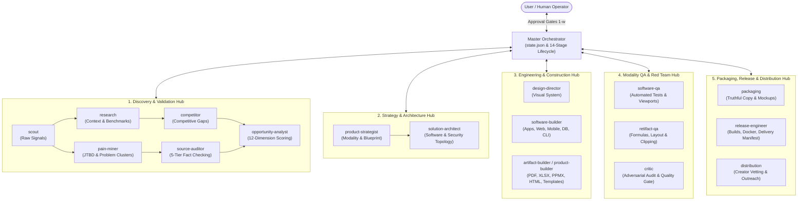
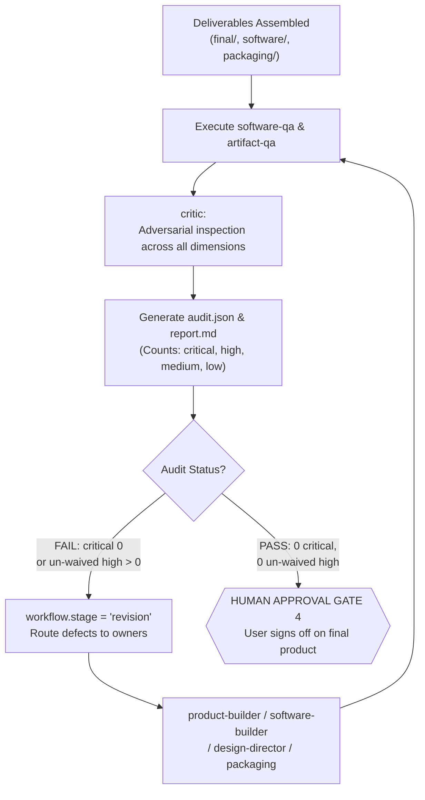
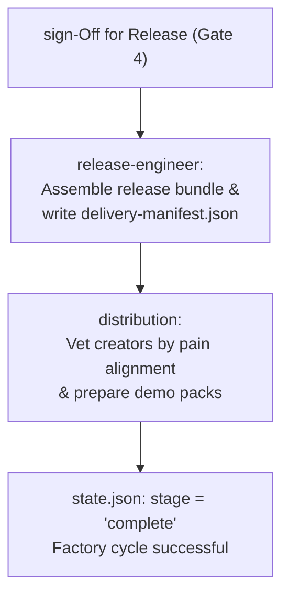

import os

content = '''# AI Product Factory

An autonomous, multi-agent digital product engineering studio operating via **Google Antigravity CLI (`agy`)**.

The AI Product Factory converts empirically verified customer pain into validated, high-utility digital products–spanning documents, templates, interactive tools, web applications, mobile/tablet software, browser extensions, APIs, databases, automations, and hybrid multi-format ecosystems.

---

## 1. What This Factory Is & The Problems It Solves

* **No Fake Market Demand:** All opportunity scoring requires primary evidence recorded in `memory/sources.csv`. Social volume or keyword metrics alone never justify building.
* **The 'Document-Only' Assumption:** Most AI builders only output text. The II Product Factory evaluates 23 distinct digital modalities and chooses the simplest mechanism capable of delivering the customer transformation.
* **Actual Software & Artifact Generation:** Software products generate real repositories with dependencies, configurations, tests, and build scripts.
 **Truthful Packaging:** Commercial copy is generated strictly from inspected final deliverables in `products/<product_id>/final/` or `products/<product_id>/software/`.
* **Adversarial Quality Control:** Red-team quality control (`critic`, `software-qa`, `artifact-qa`) tests deliverables before any product can ship.

---

## 2. Factory Core Lifecycle & Principle

The factory operates strictly according to:
```text
CUSTOMER PROBLEM
  -> DESIRED TRANSFORMATION
  -> OPPORTUNITY
  -> PRODUCT STRATEGY
  -> PRODUCT MODALITY DECISION
  -> TECH^ICAL ARCHITECTURE (WHEN REQUIRED)
  -> CONSTRUCTION (CONTENT + SOFTWARE)
  -> MODALITY-SPECIFIC QA
  -> COMMERCIAL PACKAGING
  -> RED TEAM AUDIT
  -> HUMAN APPROVAL GATE 4
  -> RELEASE (BUILDABLE / DEPLOYABLE)
  -> CREATOR DISTRIBUTION
```

---

## 3. System Architecture & Orchestration

The factory coordinates 18 specialized worker agents through a centralized Master orchestrator:



---

## 4. Discovery Workflow

@``mermaid
flowchart TD

    DomainSeed["user Domain / Problem Seed"] --> ScoutStep["scout: Harvest raw friction points\n(Reddit, forums, reviews)"]
    ScoutStep --> LogSources[("Log verified URLs in\nmemory/sources.csv")]
    ScoutStep --> ResearchStep["research: Map domain benchmarks\nand workflow constraints"]
    ScoutStep --> PainStep["pain-miner: Synthesize JTBD\nand acute pain clusters"]
    ResearchStep --> CompStep["competitor: Map incumbent flaws\nand pricing gaps"]
    LogSources --> AuditStep["source-auditor: Verify claim support\nand freshness"]
    PainStep --> ScoreStep{"opportunity-analyst: 12-dimension\nweighted scoring (scoring.md)"}
    CompStep --> ScoreStep
    AuditStep --> ScoreStep
    ScoreStep --> Gate1{{"HUMAN APPROVAL GATE 1\nIdentify & approve opportunity ID"}}
```

---

## 5. Product Type & Modality Decision

@``mermaid
flowchart TD

    ApprovedOpp["Approved Opportunity\n(Gate 1)"] --> Evaluate["product-strategist:\nEvaluate Solution Levels"]
    Evaluate --> Level1["1. Simplest Valid Solution\n(Document, Spreadsheet, Template)"]
    Evaluate --> Level2["2. Best CX Solution\n(Interactive Tool, PWA, Utility)"]
    Evaluate --> Level3["3. Higher Complexity Solution\n(SaaS, Mobile, APIs, Multi-Agent)"]
    Level1 --> Compare{"Evaluate Frequency, Data,\nInteraction & Monetization"}
    Level2 --> Compare
    Level3 --> Compare
    Compare --> Decision["Select Modality & Record Rationale\n(products/<id>/specification.json)"]
    Decision --> Gate2;{"HUMAN APPROVAL GATE 2\nUser approves format & promise"}}
```

---

## 6. Product Modality Branches & Routing

@``mermaid
flowchart TD

    Gate2Approved["specification.json Approved (Gate 2)"] --> ModalityCheck{"Selected Modality?"}

    
    ModalityCheck -->|Document / Template| DocRoute["product-builder -> design-director\n-> artifact-builder -> artifact-qa"]
    ModalityCheck -->|Interactive Tool| ToolRoute["solution-architect -> software-builder\n-> software-qa -> artifact-qa"]
    ModalityCheck -->|Web / Mobile / Desktop| AppRoute["solution-architect -> design-director\n-> software-builder -> software-qa -> release-engineer"]
    ModalityCheck -->|API / Service| APIRoute["solution-architect -> software-builder\n-> software-qa -> release-engineer"]
    ModalityCheck -->|Database Product|DBRoute["solution-architect -> software-builder\n-> artifact-builder -> software-qa -> artifact-qa"]
    ModalityCheck -->|Hybrid Ecosystem| HybridRoute["solution-architect -> parallel builders\n-> unified software & artifact QA -> release-engineer"]

    DocRoute --> PackagingStage["packaging: Truthful offer & copy"]
    ToolRoute --> PackagingStage
    AppRoute --> PackagingStage
    APIRoute --> PackagingStage
    DBRoute --> PackagingStage
    HybridRoute --> PackagingStage
```

---

## 7. Software Build & Artifact Pipeline

@``mermaid
flowchart LR

    subgraph SoftwareStream ["Software Generation Stream"]
        ArchSpec["architecture.md\n& architecture.json"] --> SourceCode["src/, tests/, package.json\n& .env.example"]
        SourceCode --> SoftBuild["Local sandbox build\n& automated test run"]
        SoftBuild --> DeployArtifact["dist/ or Dockerfile\nor extension.zip"]
    end

    subgraph ArtifactStream ["File Artifact Stream"]
        ContentDraft["product-builder drafts\n& structured data"] --> FileCompile["Python builder / HTML\n/ OpenPyXL / Pandoc"]
        FileCompile --> PhysicalFile[.pdf, .xlsx, .pptx\nor template bundles]
    end

```

---

## 8. Adversarial QA Fedback & Revision Loop



---

3# 9. Release & Distribution Pipeline



---

## 10. The 18 Specialized Agents Roster

All 18 agents reside in `.agents/agents/<name>/agent.md`:

| Agent Name | Model | Role & Responsibility | Key Deliverables |
| :--- | :--- | :--- | :--- |
| **`master`** | ```pro```| Repository orchestrator, state manager, and human gatekeeper. | `state.json`, `memory/decisions.md` |
|| **scout`** | ```flash`` | Harvests raw customer pain signals from public communities. | `research/raw/`, `memory/sources.csv` |
| ***researchf* | ```pro`` | Investigates domain context, incumbent models, and benchmarks. | `research/verified` |
| ***pain-miner`** | ```pro``| Clusters raw signals into jobs-to-be-done and root problems. | `research/synthesis/pain-clusters.md` |
| **`source-auditor`** | ```pro``| Fact-checks all claims against Tier 1-5 source hierarchy. | `research/verified/source-audit.md` |
| ***competitor`** | ```pro``| Maps competitor flaws and pricing gaps. | `research/synthesis/competitive-analysis.md` |
| ***opportunity-analyst`** | ```pro``| 12-dimension weighted scoring and ranking. | `memory/opportunities.csv` |
| ***product-strategist`** | ```pro`` | Specifies product blueprint, transformation, and modality decision. | `products/<product_id>/specification.json` |
| **`solution-architect`** | ```pro`` | Technical architecture, data models, security, and deployment topology. | `products/<product_id>/architecture.md` |
| **`software-builder`** | ```pro`` | Builds executable codebases (web, mobile, desktop, CLI, API, DB). | products/<product_id>/software/` |
| **`artifact-builder`** | ```pro`` | Generates physical customer files (PDF, XLSX, PPMX, HTML, Infotypes). | `products/<product_id>/artifact-manifest.json` |
| **`rproduct-builder`** | ```pro`` | Crafts modular content, frameworks, worksheets, and checklists. | `products/<product_id>/content/` |
| ***design-director`** | ```pro`` | Establishes and applies visual systems adhering to 6 Pillars. | `design/<product_id>/design-system.md` |
|| **software-qa`** | ```pro`` | Executes automated tests, builds, and viewport validation. | `products/<product_id>/audit/software-qa.json` |
| **`artifact-qa`** | ```pro`` | Inspects rendered files for formatting, clipping, and formulas. | products/<product_id>/audit/artifact-qa.json` |
| **`critic`** | ```pro`` | Adversarial red-team auditor with veto authority. | `products/<product_id>/audit/audit.json` |
| ***packaging`** | ```pro`` | Truthful marketing copy, offer structures, and mockups. | `packaging/<product_id>/` |
| ***release-engineer`** | ```pro``| Packages builds, installers, containers, and delivery manifest. | `products/<product_id>/delivery-manifest.json` |
| **`distribution`** | ```pro`` | Vets creators and crafts customized collaboration packs. | `distribution/<product_id>/creator-shortlist.md` |

---

## 11. Supported Product Modalities (23 Total)

The factory supports 23 specific digital product modalities (detailed in `system/product-types.md` and `system/product-output-matrix.md`):
1. **Documents:** PDF, DOCX, EPU@, Markdown, HTML manuals, workbooks, playbooks.
2. **Templates:** Notion, Excel, Google Sheets, Canva, Figma, CRM, prompt bundles.
3. **Productivity Artifacts:** Formatted XLSX, XLSM, CSV, PPTX slide decks, fillable PDF forms.
4. **Interactive Tools:** ROI estimators, scoring tools, diagnostics, configurators, calculators.
5. **Web Applications:** Static websites, landing pages, responsive PWAs, full-stack web apps, client portals.
6. **Mobile Applications:** iOS, Android, cross-platform mobile apps (React Native, Expo, Capacitor).
7. **Tablet Applications:** Touch-optimized tablet apps, stylus workbooks, field inspection dashboards.
8. **Desktop Applications:** Windows, macOS, Linux desktop apps (Tauri, Electron, Python GUI), local utilities.
9. **Browser Extensions:** Chrome, Edge, and Firefox extensions (Manifest V3).
10. **CLI / Developer Tools:** Command-line utilities, SDKs, npm/PyPI packages, code generators.
11. **APIs & Services:** REST, GraphQL, webhook relays, microservices, containerized backends.
12. **Database Products:** SQLite database files, SQL dump packs, migrations, data dictionaries.
13. **Data Products:** Curated datasets, benchmark directories, structured research packs.
14. **Automation:** n8n workflows, Make/Zapier recipes, scheduled Python pipelines, webhook automations.
15. **AI Products:** RAG assistants, document Q&A tools, agentic workflows, prompt evaluation harnesses.
16. **Multimedia:** Video/audio course scripts, curated SVG icon packs, graphic bundles.
17. **Education:** Interactive course portals, training curricula, self-paced certification modules.
18. **Games & Interactive:** Browser simulations, educational HTML5 games, gamified training.
19. **Plugins & Integrations:** Figma plugins, WordPress plugins, Slack apps, Notion integrations.
20. **Bots:** Slack, Discord, and Telegram conversational bots.
21. **Device / Embedded:** Local IoT dashboards, hardware configuration utilities.
22. **XR & 3D:** WebXR experiences, 3D interactive viewers, GLTF configurators.
23. **Hybrid Products:** Coordinated multi-modality bundles (e.g. Web App + Strategy Playbook + Excel Model).

---

## 12. Strategic Human Approval Gates

The Master Agent operates with bounded autonomy and halts for explicit user approval at four gates:
* **Gate 1 - Opportunity Selection:** User selects or approves the target opportunity ID.
* **Gate 2 - Product Strategy and Scope:** User approves the product modality, promise, and complexity level.
* **Gate 3 - Major Design Direction:** User approves visual theme, palette, and layout hierarchy.
* **Gate 4 - Final Product and Distribution Release:** User gives final sign-off before packaging release and outreach.

---

## 13. How to Start a Project in Antigravity
1. Launch Antigravity CLI:
   ```bash
   agy
   ```
2. Verify all 18 custom agents are detected:
   ```text
   /agents
   ```
3. Start the Master Agent:
   ```bash
   agy --agent master
   ```
4. Provide a target domain or problem seed:
   ```text
   Master, initiate discovery in the developer tooling space focusing on API schema drift in microservices.
   ```
