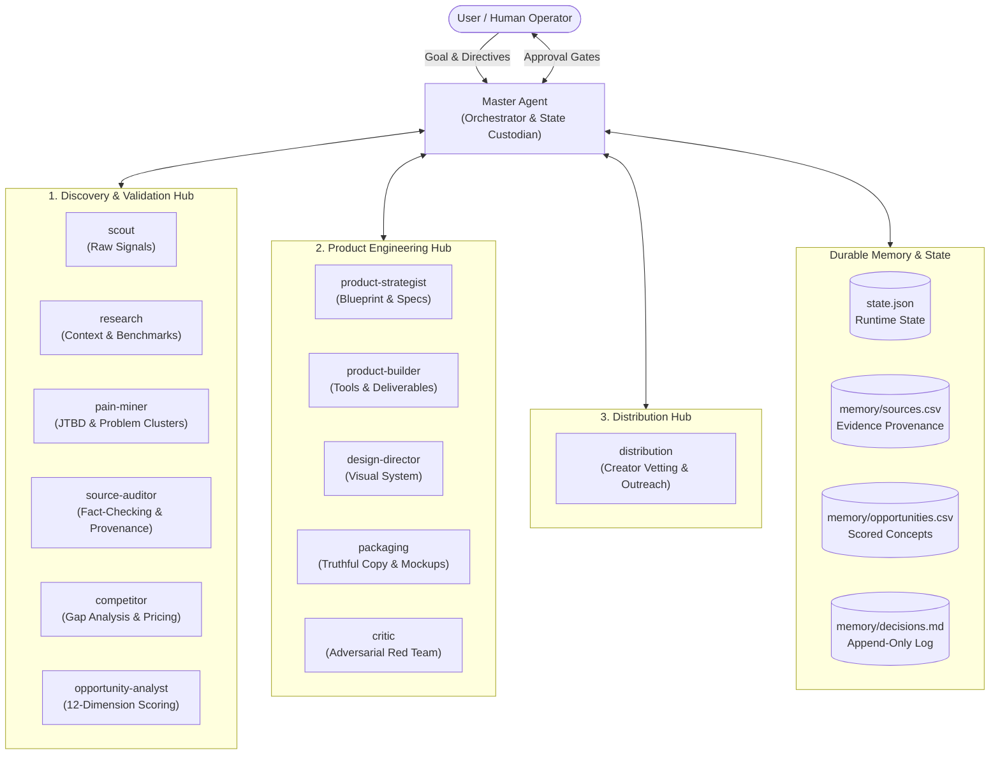
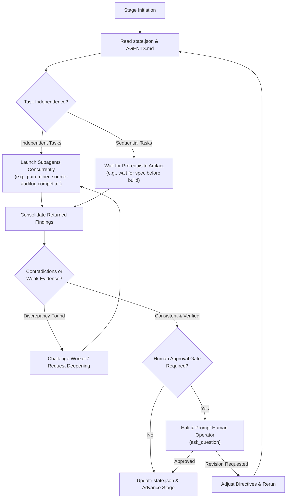
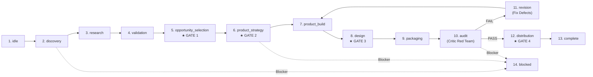
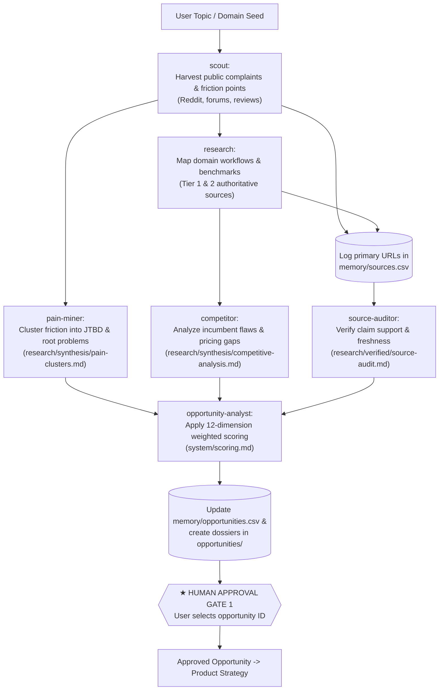
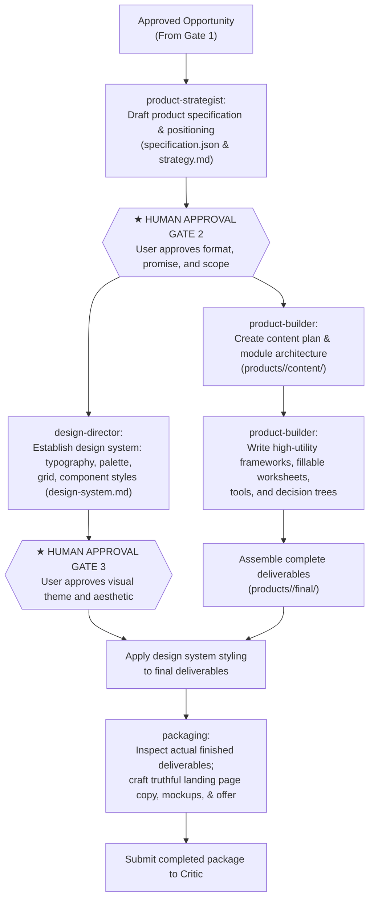
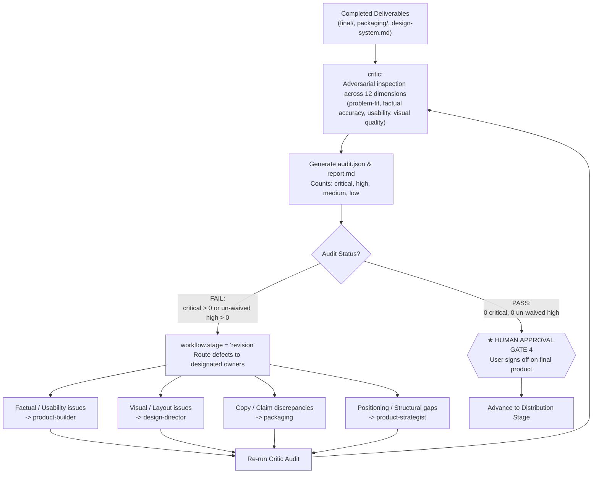

# AI Product Factory

An autonomous, multi-agent digital product studio operating inside **Google Antigravity CLI (`agy`)**.

The AI Product Factory converts empirical customer pain into commercially viable, high-utility digital products (templates, frameworks, workbooks, guides, toolkits), crafts functional design systems, generates truthful packaging copy, performs adversarial red-team quality audits, and prepares targeted creator-driven distribution campaigns.

---

## 1. What This Project Is

The AI Product Factory is a production-ready repository template for disciplined multi-agent orchestration. Instead of generating generic, ungrounded content with a single prompt, the factory uses a team of 13 specialized agents coordinated by a Master orchestrator. 

All agents operate under strict epistemic invariants, write durable artifacts to the repository, adhere to JSON schemas, and pause for human validation at four strategic decision gates.

### The Problem It Solves

* **Hallucinated Research & Market Demand:** Many AI workflows mistake keyword search volume or social mentions for true willingness to pay. The factory requires primary source provenance registered in `memory/sources.csv` before scoring any opportunity.
* **Superficial "AI Filler":** Conventional LLM products often output shallow lists and generic advice. The factory enforces concrete frameworks, fillable worksheets, decision trees, and step-by-step implementation workflows.
* **Exaggerated Packaging Claims:** Marketing copy often promises transformations that the product does not deliver. The packaging agent works exclusively from inspected, completed deliverables.
* **Lack of Quality Control:** The factory includes an independent adversarial red-team auditor (`critic`) that actively searches for reasons *not* to ship before release.
* **Context Window Bloat:** Rather than running one massive monolithic prompt, 13 scoped custom agents execute targeted roles with dedicated tool sets.

---

## 2. Architecture & Multi-Agent Orchestration

The workspace organizes 13 custom agents into three functional hubs under the leadership of the Master Agent:

### Overall AI Product Factory Architecture

The following diagram illustrates the relationship between the Master Agent, the functional worker hubs, persistent memory, and final outputs:



*Text Summary:* The Master Agent acts as the central coordinator between the user, the Discovery Hub, the Product Engineering Hub, the Distribution Hub, and persistent repository memory.

---

### Multi-Agent Orchestration Model

The Master Agent coordinates workers using Antigravity's subagent delegation mechanism (`invoke_subagent`). Independent tasks run concurrently, while dependent tasks wait for prerequisite artifacts:



*Text Summary:* The Master checks prerequisites, runs independent subagents concurrently, consolidates outputs, cross-checks for contradictions, and pauses for explicit human approval before advancing stages.

---

## 3. Agent Roster & Roles

All 13 custom agents are defined in `.agents/agents/{name}/agent.md`:

| Agent Name | Model | Type | Role & Responsibility | Key Deliverables |
| :--- | :--- | :--- | :--- | :--- |
| **`master`** | `pro` | Main / Subagent | Repository orchestrator, human gatekeeper, state manager, and final quality custodian. | `state.json`, `memory/decisions.md` |
| **`scout`** | `flash` | Worker | Discovers unprompted customer pain signals across Reddit, forums, and reviews. | `research/raw/`, `memory/sources.csv` |
| **`research`** | `pro` | Worker | Investigates domain context, industry workflows, incumbent models, and benchmarks. | `research/verified/` |
| **`pain-miner`** | `pro` | Worker | Clusters raw signals into jobs-to-be-done, root problems, and workarounds. | `research/synthesis/pain-clusters.md` |
| **`source-auditor`**| `pro` | Worker | Adversarial fact-checker auditing claims against the 5-tier source hierarchy. | `research/verified/source-audit.md` |
| **`competitor`** | `pro` | Worker | Maps incumbents, customer complaints, and churn drivers to isolate market gaps. | `research/synthesis/competitive-analysis.md` |
| **`opportunity-analyst`**| `pro` | Worker | Evaluates clusters using the 12-dimensional weighted rubric in `system/scoring.md`. | `memory/opportunities.csv`, `opportunities/<id>.md` |
| **`product-strategist`**| `pro` | Worker | Formulates full product specification, unique mechanism, format, and transformation. | `products/<id>/specification.json`, `strategy.md` |
| **`product-builder`**| `pro` | Worker | Constructs actionable content, fillable templates, checklists, and tools. | `products/<id>/final/` |
| **`design-director`**| `pro` | Worker | Creates and enforces visual systems adhering to the 6 Pillars of Premium Design. | `design/<id>/design-system.md` |
| **`packaging`** | `pro` | Worker | Crafts truthful sales copy, offer stack, bonuses, and landing page content. | `packaging/<id>/` |
| **`critic`** | `pro` | Worker | Red-team auditor finding reasons NOT to ship (`critical`, `high`, `medium`, `low`). | `products/<id>/audit/audit.json`, `report.md` |
| **`distribution`** | `pro` | Worker | Vets prospective creator partners and generates tailored collaboration packs. | `distribution/<id>/creator-shortlist.md` |

---

## 4. End-to-End Product Workflow

The factory runtime state machine tracks progression across **14 canonical stages**:



*Text Summary:* Progression moves linearly from discovery through research, validation, opportunity selection, strategy, build, design, packaging, and audit. If the audit fails, execution loops back to revision until all critical/high issues are cleared.

---

## 5. Opportunity Discovery Pipeline

The discovery cycle follows a strict empirical progression from raw signals to human selection:



*Text Summary:* Problem signals gathered by `scout` and `research` are processed into pain clusters by `pain-miner`, audited by `source-auditor`, and matched with competitor gaps by `competitor`. `opportunity-analyst` then scores and ranks them for human approval.

---

## 6. Product Creation Pipeline

Once an opportunity is approved, it is transformed into an engineered digital deliverable:



*Text Summary:* Product development proceeds from specification (`product-strategist`) to human approval, modular construction (`product-builder`), visual design system (`design-director`), assembly, and truthful packaging (`packaging`).

---

## 7. Quality Control & Revision Loop

The Critic agent acts as an independent red team. A deliverable cannot ship without passing this gate:



*Text Summary:* The Critic inspects deliverables and classifies defects. Any critical or un-waived high defect triggers the revision loop, assigning fixes to the responsible agent before re-auditing.

---

## 8. Persistent Repository Memory

The factory preserves institutional memory across sessions using dedicated, structured files:

* **`state.json`:** Single source of truth for runtime project state, active stage, and blockers.
* **`memory/sources.csv`:** Central source provenance ledger. Every claim in research, specs, or sales copy must trace back to a valid source ID with assigned tier (1–5) and confidence.
* **`memory/opportunities.csv`:** Complete registry of all evaluated opportunities, tracking 12-dimensional scores, overall weighted score, and status.
* **`memory/decisions.md`:** Append-only log recording strategic choices, human approvals, architectural pivots, and audit waivers.
* **`memory/rejected-ideas.md`:** Catalog of dismissed ideas and explicit reasons for rejection, preventing repetitive discovery loops.
* **`memory/customers.json`:** Reusable customer profiles complying with `system/schemas/customer.schema.json`.

---

## 9. Strategic Human Approval Gates

The Master Agent operates with bounded autonomy. It halts and prompts the operator via `ask_question` at exactly four gates:

1. **Gate 1 — Opportunity Selection:** After opportunities are scored and ranked. The human selects the opportunity ID before product strategy begins.
2. **Gate 2 — Product Strategy & Specification:** After `specification.json` is generated. The human approves the product format, core promise, scope, and transformation.
3. **Gate 3 — Major Design Direction:** After `design-system.md` is drafted. The human approves the visual tone, palette, and typography before full visual formatting.
4. **Gate 4 — Final Product & Distribution Approval:** After all Critic audit issues are resolved. The human gives final approval before packaging release and creator outreach.

---

## 10. How Custom Agents Are Discovered

Antigravity CLI discovers custom agents by scanning the project workspace for `.agents/agents/{agent_name}/agent.md`.

For an agent to be discovered:
1. **Directory Structure:** Must reside in `.agents/agents/{name}/agent.md`.
2. **Valid YAML Frontmatter:** Must include standard fields:
   * `name`: Matching the folder identifier.
   * `description`: Explaining the agent's specialized role.
   * `tools`: List of valid Antigravity tool identifiers.
   * `subagent: true`: Allows the agent to be invoked via `invoke_subagent`.
   * `mainAgent: true` (for `master` only) or `mainAgent: false` (for workers).
   * `model`: Model tier (`pro`, `flash`, or `inherit`).
   * `commandExecutionPolicy: sandbox`: Standard execution security mode.

To verify discovery, run `/agents` inside the Antigravity CLI. All 13 custom agents will appear in the panel.

---

## 11. Workspace Setup & Installation

### Prerequisites
* **Google Antigravity CLI (`agy`)** installed and authenticated.
* **Git** installed on your system.

### Option A: Use as a GitHub Template (Recommended)
1. Click the **"Use this template"** button at the top of the GitHub repository.
2. Select **"Create a new repository"**.
3. Name your repository (e.g., `my-product-factory`) and clone it locally:
   ```bash
   git clone https://github.com/<your-username>/my-product-factory.git
   cd my-product-factory
   ```

### Option B: Clone Directly
```bash
git clone https://github.com/codinghubindia/ai-product-factory-template.git my-product-factory
cd my-product-factory
```

---

## 12. How to Start Antigravity & Begin a Project

1. **Launch Antigravity:**
   From the repository root, start the Antigravity CLI:
   ```bash
   agy
   ```

2. **Verify Agent Discovery:**
   Type `/agents` in the prompt. You should see `master` and all 12 worker agents listed.

3. **Select the Master Agent:**
   Select `master` from the panel, or start directly with:
   ```bash
   agy --agent master
   ```

4. **Initiate Product Discovery:**
   Provide a target domain, market, or audience pain point to the Master Agent:
   ```text
   Master, start discovery in the creator economy space focusing on workflow bottlenecks for video editors handling client revisions.
   ```

5. **Participate at Approval Gates:**
   The Master Agent will orchestrate the workers, harvest evidence, cluster pain, and halt at **Gate 1** with ranked opportunities for your approval.

---

## Repository Structure

```
├── .agents/agents/         # 13 Antigravity custom agent definitions
│   ├── master/agent.md     # Master orchestrator
│   ├── scout/agent.md      # Raw signal harvesting
│   ├── research/agent.md   # Domain & benchmark investigation
│   ├── pain-miner/agent.md # Problem clustering & JTBD
│   ├── source-auditor/agent.md # Evidence fact-checking
│   ├── competitor/agent.md # Competitor gap analysis
│   ├── opportunity-analyst/agent.md # 12-dimension scoring
│   ├── product-strategist/agent.md  # Product specification
│   ├── product-builder/agent.md     # Deliverables construction
│   ├── design-director/agent.md     # Visual design system
│   ├── packaging/agent.md           # Truthful sales copy & mockups
│   ├── distribution/agent.md        # Creator vetting & outreach
│   └── critic/agent.md              # Adversarial red-team audit
├── design/                 # Per-product design systems and visual standards
├── distribution/           # Creator shortlists, vetting notes, and outreach packs
├── memory/                 # Durable project memory
│   ├── sources.csv         # Evidence provenance registry
│   ├── opportunities.csv   # Scored opportunity candidates
│   ├── decisions.md        # Strategic decision log
│   ├── rejected-ideas.md   # Record of rejected concepts
│   └── customers.json      # Target customer persona profiles
├── packaging/              # Commercial landing page copy, offer structures, and mockups
├── products/               # Specifications, content drafts, assets, final deliverables, and audits
├── research/               # Raw evidence, verified domain notes, and synthesized problem clusters
│   ├── raw/                # Scrapes and unfiltered notes (.gitkeep)
│   ├── verified/           # Fact-checked benchmarks and claim audits (.gitkeep)
│   └── synthesis/          # Pain clusters and competitive gaps (.gitkeep)
│       └── opportunities/  # Individual opportunity dossiers (.gitkeep)
├── system/                 # Schemas, transparent scoring rubrics, and detailed workflows
│   ├── schemas/            # JSON schemas (audit, customer, opportunity, product, source)
│   ├── workflows/          # Execution workflows (discovery, product-build, distribution)
│   └── scoring.md          # 12-dimensional weighted scoring system & rubrics
├── state.json              # Runtime state machine tracking current lifecycle stage and blockers
├── AGENTS.md               # Master governing constitution and epistemic rules
└── README.md               # Canonical project documentation and guide
```

---

## License

MIT License. Free to use, adapt, and build upon.

