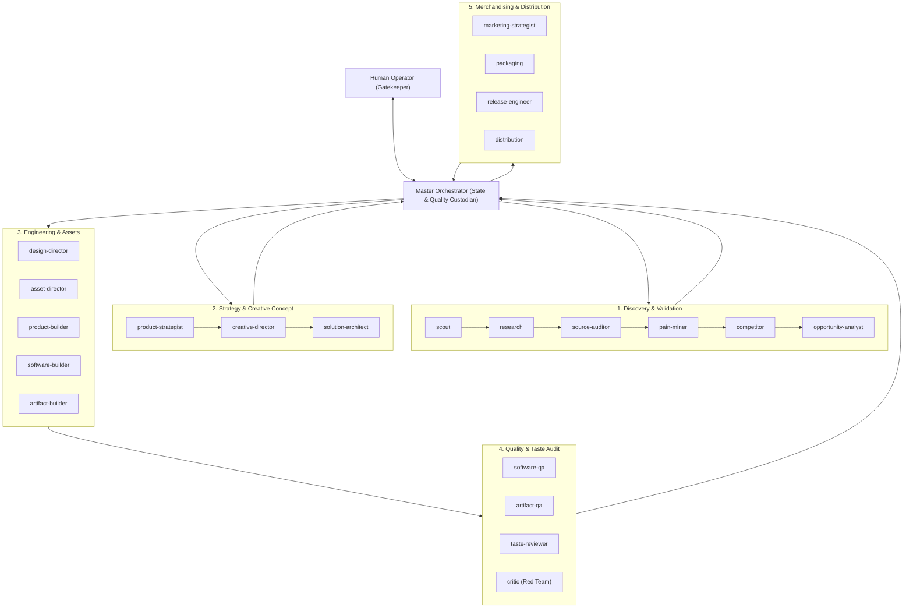
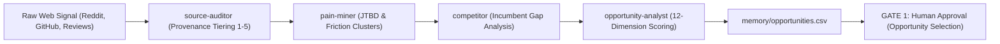
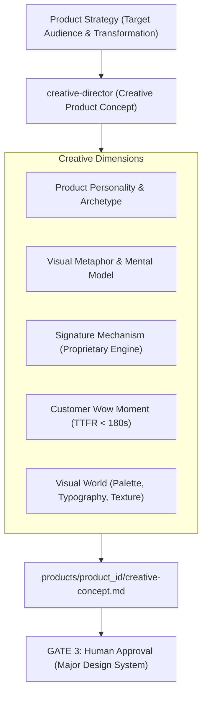
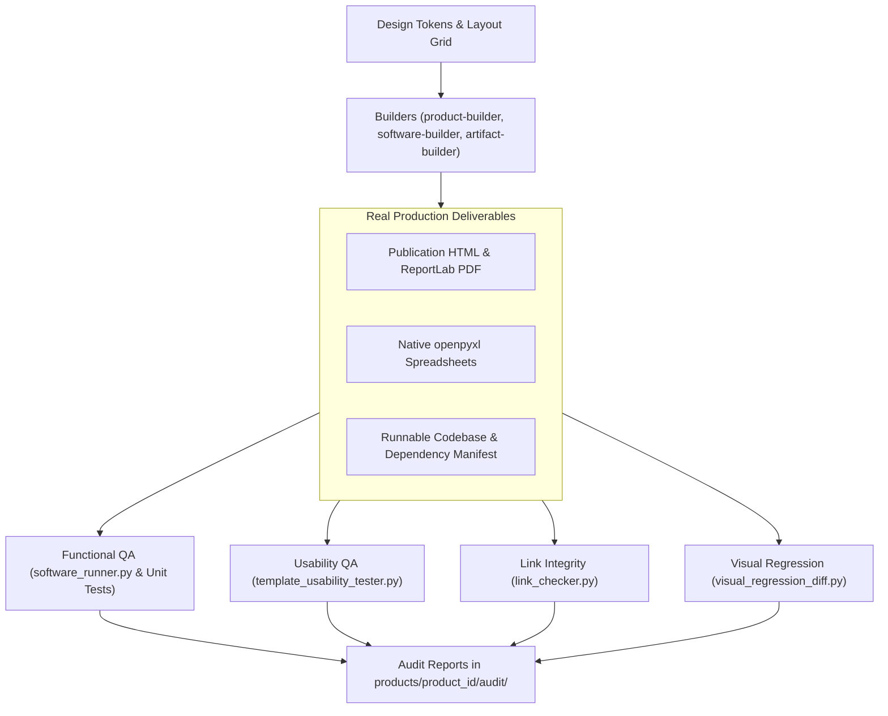
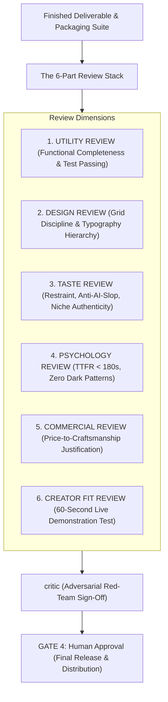
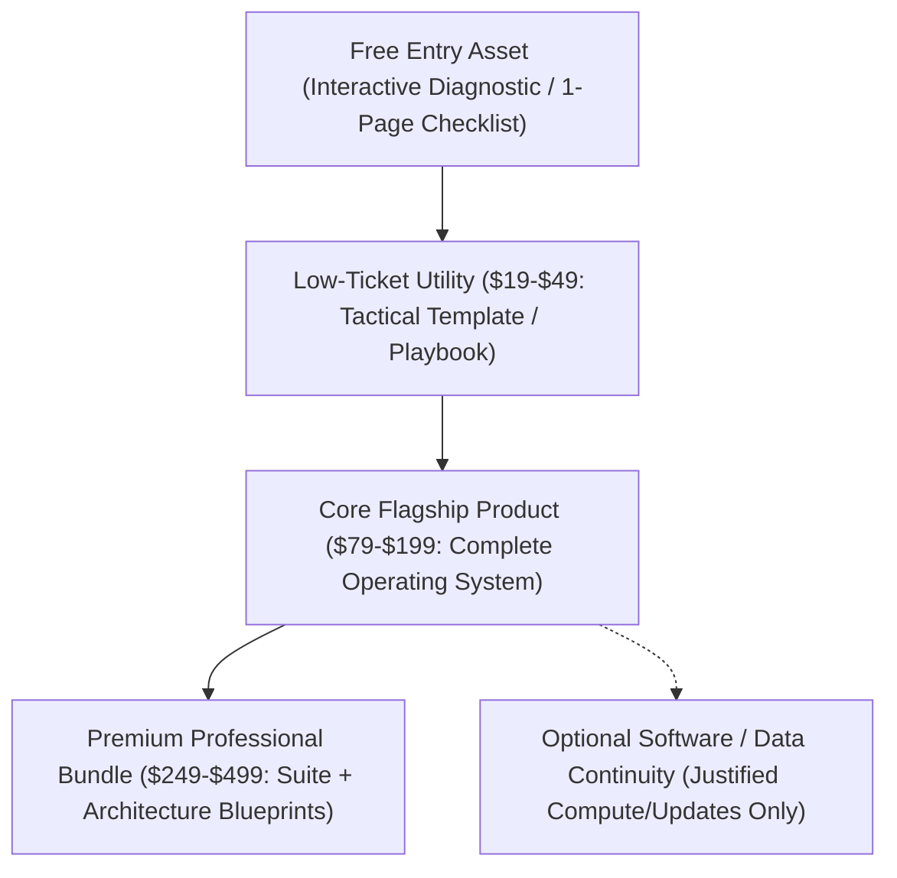

# AI Product Factory

An autonomous, disciplined multi-agent system designed to discover empirical customer pain, validate commercial viability, engineer high-utility digital products, establish authentic creative concepts, curate licensed visual assets, enforce publication-grade taste standards, and prepare creator-driven distribution.

Operated via the **Antigravity CLI** (`agy`).

---

## 1. Factory Architecture

The factory orchestrates **23 specialized worker agents** under the sovereign direction of the **Master Agent**, organized across 6 functional hubs.



The Master Agent enforces state transitions recorded in `state.json`, durable repository memory (`memory/`), and four mandatory human approval gates using interactive decision prompts.

---

## 2. Creator-Led Opportunity Discovery

Raw signals are harvested from verbatim discussions and filtered through a multi-stage evidence sieve before human selection.



- **Verbatim Evidence:** Every pain hypothesis requires direct quotations from practitioners.
- **Provenance Tiering:** Sources must meet Tier 1 (primary documentation) or Tier 2 (practitioner consensus) standards; anonymous blog hearsay is rejected.
- **Transparent Scoring:** Opportunities are ranked across 12 commercial and technical dimensions including Pain Severity, Market Viability, and Demonstration Feasibility.

---

## 3. Product Modality Selection

The factory rejects the assumption that every digital product should be a PDF or an ebook. It systematically evaluates three solution levels across 21+ supported modalities:

```mermaid
flowchart TD
    In["Validated Opportunity (Gate 1 Approved)"] --> Eval["product-strategist (Modality Evaluation)"]

    Eval --> OptA["Level 1: Simplest Valid Solution (Checklist, Model, SOP Playbook)"]
    Eval --> OptB["Level 2: Best CX Solution (Interactive PWA, Responsive Calculator, Tool)"]
    Eval --> OptC["Level 3: Higher-Complexity Solution (Full-Stack Web App, Native Mobile, API)"]

    OptA --> Select["Decision Gate: Select Simplest Mechanism that Delivers Full Transformation"]
    OptB --> Select
    OptC --> Select

    Select --> Spec["products/product_id/specification.json"]
    Spec --> Gate2["GATE 2: Human Approval (Modality & Strategy)"]
```



Supported modalities include:
- **Documents & Publishing:** Executive Playbooks, Manuals, Whitepapers, Workbooks.
- **Templates & Calculators:** Financial Models, Spreadsheets, Diagnostic Rubrics.
- **Software Applications:** Progressive Web Apps, Single-Page Apps, CLI Utilities, Desktop Tools.
- **Backend & Data:** REST APIs, Curated SQLite Databases, Automation Scripts, Webhooks.
- **Hybrid Suites:** Multi-tier coordinated bundles combining software, playbooks, and templates.

---

## 4. Creative Concept & Signature Mechanism Layer

Before visual design or software construction, the `creative-director` establishes the product's emotional core, visual metaphor, and proprietary mechanism.



- **The Signature Mechanism:** Every flagship deliverable must engineer an internal engine (Diagnostic Sieve, 90-Day Cadence, Scoring Rubric, or Decision Matrix) that can be demonstrated on video in under 60 seconds.
- **Customer Wow Moment:** The Time to First Useful Result (TTFR) must occur within 180 seconds of opening the deliverable, delivering an immediate micro-win without setup friction.

---

## 5. Visual Asset Generation & Provenance Pipeline

Visual assets are engineered functional components governed by a 13-step production pipeline and cataloged in a formal manifest.


- **Zero Whitespace Fillers:** Visual assets are generated only to clarify complex architecture, establish visual anchors, or demonstrate product mechanics.
- **Visual Continuity:** All assets within a product adhere to identical lighting, perspective, rendering style, and semantic color tokens.
- **100% Provenance:** Every asset records its generator prompt or canonical source URL, licensing status, and dimensions in `products/<product_id>/assets/asset-manifest.json`.

---

## 6. Product Build, Testing & Usability QA

Products are compiled into real, executable physical files and runtimes, followed by multi-stage automated testing.



- **Editorial Standards:** Books and guides adhere to the 24 Editorial Dimensions, 45–75 character line measures, drop caps, and 22mm print binding gutters.
- **Handwriting Ergonomics:** Workbooks feature true 8.0mm–9.5mm (24pt–28pt) rule spacing and 16px checkboxes.
- **Zero Formula Errors:** Spreadsheets are scanned for `#REF!`, `#DIV/0!`, `#VALUE!`, frozen panes, and explicit currency/percentage formatting.

---

## 7. The 6-Part Premium Review Stack

Before human release approval, the product must pass all six independent evaluation layers.



- **Taste Invariant:** A product fails taste review if a practitioner would judge it to look like generic, uninspired AI output.
- **Absolute Ban on Dark Patterns:** Zero fake scarcity, zero countdown timers, zero fabricated social proof, and zero hidden costs.

---

## 8. Creator-Audience Marketing Funnel

Marketing assets emerge directly from the product's signature mechanism and verified transformation.

```mermaid
flowchart LR
    Hook["1. Creator Hook (Pattern Interrupt)"] --> Recog["2. Problem Recognition (Shared Pain)"]
    Recog --> Demo["3. 60s Video Demo (Signature Mechanism in Action)"]
    Demo --> Proof["4. Empirical Proof (Sources & Benchmarks)"]
    Proof --> Land["5. Clean Landing Page (Zero Deception)"]
    Land --> Checkout["6. Transparent Checkout (No Hidden Fees)"]
    Checkout --> TTFR["7. First Value in < 180s"]
    TTFR --> Share["8. Reusable Output Shared with Team"]
```



- **The 60-Second Rule:** If a product cannot be demonstrated live on screen in under 60 seconds, its transformation is refined until it can.
- **Creator-Specific Presentation Layer:** The core product engine remains modular while presentation layers customize welcome notes, niche example data, and partner branding.

---

## 9. Product Merchandising & Offer Ecosystem

The factory structures deliverables into calibrated commercial tiers based on customer economics rather than forced funnels.



Every offer documents customer problem, promise, transformation, contents, empirical proof, reason to believe, objection refutations, and next logical offer in `merchandising.json`.

---

## 10. Repository Structure

```text
├── .agents/
│   ├── agents/              # 23 specialized agent prompts
│   └── skills/              # Reusable engineering and creative skills
├── design/                  # Design systems and visual continuity specifications
├── memory/                  # Persistent repository memory (sources.csv, opportunities.csv)
├── packaging/               # Landing pages, creator briefs, and offer structures
├── products/                # Product specifications, content, software, and final builds
├── research/                # Raw community signals, verified evidence, and synthesis
├── system/
│   ├── schemas/             # Authoritative JSON schemas (product, asset, audit, etc.)
│   ├── scripts/             # Deterministic Python build and verification tools
│   ├── vendor/              # Local, reproducible dependencies (openpyxl, reportlab, pillow)
│   └── workflows/           # Canonical stage-gate operating workflows
├── templates/               # Reusable starter architectures for all product modalities
├── AGENTS.md                # Governing workspace constitution
├── README.md                # System overview and architecture
└── state.json               # Single source of truth for runtime project state
```

---

## 11. Command Line Interface Reference

The factory operates via the `system/scripts/` toolchain:

```bash
# 1. Inspect host environment and tooling
python system/scripts/tooling_manager.py --inspect

# 2. Compile publication-grade document and PDF with outline bookmarks
python system/scripts/pdf_compiler.py --html <path_to_html> --output <path_to_pdf>

# 3. Audit spreadsheet formulas, error tokens, and frozen panes
python system/scripts/template_usability_tester.py --input <path_to_xlsx_or_csv>

# 4. Audit visual asset manifest, licensing, and image dimensions
python system/scripts/asset_pipeline.py --manifest <path_to_asset_manifest.json>

# 5. Audit deliverables for generic AI clichés, neon gradients, and formatting
python system/scripts/taste_checker.py --input <path_to_file>

# 6. Audit internal routes, hyperlinks, and button actions
python system/scripts/link_checker.py <target_directory>

# 7. Check for layout drift and visual regressions between builds
python system/scripts/visual_regression_diff.py --base <baseline.pdf> --new <new.pdf>

# 8. Inspect compiled artifacts for placeholders and header validity
python system/scripts/artifact_inspector.py <target_directory>
```

---

## 12. Licensing & Governance

All agents operating in this repository are bound by the constitution in [AGENTS.md](AGENTS.md). All product claims, benchmarks, and citations must trace to empirical records in `memory/sources.csv`.
