# AI Product Factory — Template

**Version:** 0.3.0 | **Status:** Clean Template (Product-Neutral) | **Last reset:** 2026-09-11

A production-grade, autonomous multi-agent system for turning empirically verified customer pain into commercially viable digital products — with enforced quality gates, real specialist delegation, and creator-driven distribution.

---

## Architecture Overview

### The Core Principle: Master Orchestrates, Specialists Execute

```mermaid
flowchart TD
    USER["👤 USER\n(provides domain/seed)"]
    MASTER["🏛️ MASTER\nOrchestrator\n\nPlans · Delegates · Integrates\nVerifies · Gate Enforcer"]

    subgraph DISCOVERY_PARALLEL["⚡ Parallel Discovery"]
        SCOUT["scout\n(community signals)"]
        RESEARCH["research\n(market context)"]
        COMPETITOR["competitor\n(competitive gaps)"]
    end

    subgraph VALIDATION["Validation (Sequential)"]
        PAIN["pain-miner\n(pain clusters)"]
        AUDITOR["source-auditor\n(evidence audit)"]
    end

    OPP_ANALYST["opportunity-analyst\n(scoring)"]

    GATE1["🛑 GATE 1\nHuman Approval\n(opportunity selection)"]

    STRATEGIST["product-strategist\n(specification)"]

    GATE2["🛑 GATE 2\nHuman Approval\n(product strategy)"]

    subgraph CREATIVE_ARCH["Creative & Architecture"]
        CREATIVE["creative-director\n(concept + mechanism)"]
        ARCHITECT["solution-architect\n(when required)"]
    end

    DESIGN["design-director\n(design system)"]

    GATE3["🛑 GATE 3\nHuman Approval\n(design direction)"]

    subgraph BUILD_PARALLEL["⚡ Parallel Build (independent modules)"]
        PRODUCT_BUILDER["product-builder\n(content)"]
        SOFTWARE_BUILDER["software-builder\n(code)"]
        ASSET_DIRECTOR["asset-director\n(visual assets)"]
    end

    ARTIFACT_BUILDER["artifact-builder\n(PDF/HTML/XLSX)"]

    subgraph QA_PARALLEL["⚡ Parallel QA"]
        ARTIFACT_QA["artifact-qa\n(file inspection)"]
        SOFTWARE_QA["software-qa\n(functional testing)"]
        TASTE["taste-reviewer\n(aesthetic gate)"]
    end

    subgraph COMMERCIAL["Commercial Preparation"]
        PKG["packaging\n(landing page)"]
        MKT["marketing-strategist\n(merchandising)"]
    end

    CRITIC["critic\n(red-team audit)"]
    RELEASE["release-engineer\n(bundle + manifest)"]

    GATE4["🛑 GATE 4\nHuman Approval\n(final release)"]

    DISTRIBUTION["distribution\n(creator outreach)"]

    COMPLETE["✅ COMPLETE"]

    %% Flow
    USER -->|"provides domain"| MASTER
    MASTER -->|"invoke_subagent ×3"| DISCOVERY_PARALLEL
    DISCOVERY_PARALLEL -->|"results consolidated"| MASTER
    MASTER -->|"invoke_subagent ×2"| VALIDATION
    VALIDATION -->|"results consolidated"| MASTER
    MASTER -->|"invoke_subagent"| OPP_ANALYST
    OPP_ANALYST --> GATE1
    GATE1 -->|"human selects"| MASTER
    MASTER -->|"invoke_subagent"| STRATEGIST
    STRATEGIST --> GATE2
    GATE2 -->|"human approves"| MASTER
    MASTER -->|"invoke_subagent ×2"| CREATIVE_ARCH
    CREATIVE_ARCH -->|"results consolidated"| MASTER
    MASTER -->|"invoke_subagent"| DESIGN
    DESIGN --> GATE3
    GATE3 -->|"human approves"| MASTER
    MASTER -->|"invoke_subagent ×3"| BUILD_PARALLEL
    BUILD_PARALLEL -->|"integrated"| ARTIFACT_BUILDER
    ARTIFACT_BUILDER --> MASTER
    MASTER -->|"invoke_subagent ×3"| QA_PARALLEL
    QA_PARALLEL -->|"all results"| MASTER
    MASTER -->|"invoke_subagent ×2"| COMMERCIAL
    COMMERCIAL --> MASTER
    MASTER -->|"invoke_subagent"| CRITIC
    CRITIC --> MASTER
    MASTER -->|"invoke_subagent"| RELEASE
    RELEASE --> GATE4
    GATE4 -->|"human approves"| MASTER
    MASTER -->|"invoke_subagent"| DISTRIBUTION
    DISTRIBUTION --> COMPLETE

    %% Styling
    style MASTER fill:#1a1a2e,color:#ffffff,stroke:#4a4a8a
    style GATE1 fill:#8B0000,color:#ffffff,stroke:#ff0000
    style GATE2 fill:#8B0000,color:#ffffff,stroke:#ff0000
    style GATE3 fill:#8B0000,color:#ffffff,stroke:#ff0000
    style GATE4 fill:#8B0000,color:#ffffff,stroke:#ff0000
    style DISCOVERY_PARALLEL fill:#0d4f2f,color:#ffffff
    style BUILD_PARALLEL fill:#0d4f2f,color:#ffffff
    style QA_PARALLEL fill:#0d4f2f,color:#ffffff
    style COMPLETE fill:#155724,color:#ffffff
```



> **The Master does NOT replace specialist workers.** Every `invoke_subagent` call in the diagram represents a real invocation. The Master coordinates, verifies, and integrates — but never silently performs a worker's primary task.

---

## Mandatory Invocation Rule

> **When a workflow stage assigns a task to a specialized agent, the Master MUST invoke that agent using `invoke_subagent`.**

| ❌ Prohibited | ✅ Required |
|---|---|
| Master writes community-signals.md itself | Master invokes `scout` → verifies artifact |
| Master researches the market itself | Master invokes `research` → verifies artifact |
| Master designs the product itself | Master invokes `design-director` → verifies artifact |
| Master declares QA complete by inspection | Master invokes `artifact-qa` + `software-qa` + `taste-reviewer` |
| Master builds the PDF itself | Master invokes `artifact-builder` → verifies artifact |
| Master declares critic PASS without invoking | Master invokes `critic` → reads audit.json |

**If invocation fails:** Stop the stage. Report the failure. Do NOT silently perform the task as a fallback.

---

## The 23 Specialist Agents

### Discovery & Validation Hub
| Agent | Responsibility | Primary Artifact |
|---|---|---|
| `scout` | Raw community pain signal harvesting | `research/raw/community-signals.md` |
| `research` | Market context, workflows, benchmarks | `research/verified/market-context.md` |
| `pain-miner` | Pain clustering, JTBD analysis | `research/synthesis/pain-clusters.md` |
| `source-auditor` | Evidence provenance auditing | `research/verified/source-audit.md` |
| `competitor` | Competitive gap mapping | `research/synthesis/competitive-analysis.md` |
| `opportunity-analyst` | 12-dimension opportunity scoring | `memory/opportunities.csv` |

### Strategy & Creative Hub
| Agent | Responsibility | Primary Artifact |
|---|---|---|
| `product-strategist` | Product specification, modality decision | `products/<id>/specification.json` |
| `creative-director` | Creative concept, signature mechanism | `products/<id>/creative-concept.md` |
| `solution-architect` | Technical architecture (when required) | `products/<id>/architecture.md` |

### Engineering & Assets Hub
| Agent | Responsibility | Primary Artifact |
|---|---|---|
| `product-builder` | Content, chapters, worksheets | `products/<id>/content/` |
| `software-builder` | Executable software, APIs, databases | `products/<id>/software/` |
| `artifact-builder` | PDF, HTML, XLSX, DOCX, ZIP output | `products/<id>/deliverables/` |
| `design-director` | Visual system, typography, grid | `design/<id>/design-system.md` |
| `asset-director` | Image generation, licensing, catalog | `products/<id>/assets/asset-manifest.json` |

### Quality, Taste & Red Team Hub
| Agent | Responsibility | Primary Artifact |
|---|---|---|
| `artifact-qa` | Physical file inspection | `products/<id>/audit/artifact-qa.json` |
| `software-qa` | Functional testing, link audit | `products/<id>/audit/software-qa.json` |
| `taste-reviewer` | Aesthetic gate, anti-AI-slop | `products/<id>/audit/taste-review.md` |
| `critic` | Adversarial red-team audit | `products/<id>/audit/audit.json` |

### Commercial & Distribution Hub
| Agent | Responsibility | Primary Artifact |
|---|---|---|
| `marketing-strategist` | Customer psychology, merchandising | `products/<id>/merchandising.json` |
| `packaging` | Landing page, offer structure | `packaging/<id>/landing-page.md` |
| `release-engineer` | Release bundle, delivery manifest | `products/<id>/manifest.json` |
| `distribution` | Creator fit, outreach packs | `distribution/<id>/creator-outreach-pack.md` |

---

## Parallel Execution Model

The factory exploits independent task parallelism using simultaneous `invoke_subagent` calls:

```
Discovery:    scout ──┐
              research ─┤ (all simultaneously)
              competitor┘

QA:           artifact-qa ──┐
              software-qa ───┤ (all simultaneously, on frozen build)
              taste-reviewer─┘

Build:        independent content modules (simultaneously)
              independent software services (simultaneously)
```

**Rule:** Never parallelize tasks where Agent B requires Agent A's direct output. Complete dependencies before invoking dependents.

---

## Stage Completion Gates

A stage advances only when ALL of the following are verified:

1. ✅ All required agent invocations recorded in delegation log
2. ✅ All required artifact files exist at expected paths
3. ✅ All artifact files are non-empty
4. ✅ Schema validation passes for structured artifacts
5. ✅ Contradictions across worker outputs resolved
6. ✅ Stage-specific QA criteria satisfied
7. ✅ `state.json` updated to reflect stage completion
8. ✅ If a human gate applies: `ask_question` called and approved

---

## The 4 Mandatory Human Approval Gates

| Gate | Timing | What the human decides |
|---|---|---|
| **GATE 1** | After opportunity scoring | Which opportunity to pursue |
| **GATE 2** | After product specification | Product modality, scope, and transformation |
| **GATE 3** | After design system | Visual tone, palette, typography, layout |
| **GATE 4** | After all QA and audit | Final release and distribution sign-off |

None of these gates can be bypassed. The Master halts and waits for explicit human response.

---

## Skill-First Execution

Before invoking any specialist, the Master must:
1. Identify the relevant skill in `.agents/skills/`
2. Identify relevant templates in `templates/`
3. Identify required scripts in `system/scripts/`
4. Pass these explicitly to the worker in the invocation prompt

**Available skills:**
- `creative-direction` — Creative concept and worldbuilding
- `premium-document-production` — Publication-grade documents
- `editorial-design` — Books, playbooks, guides
- `workbook-planner-design` — Workbooks, journals, planners
- `pdf-publishing` — PDF compilation pipelines
- `ui-ux-design` — Web and app interface design
- `web-app-development` — Web application architecture
- `mobile-app-development` — Mobile and PWA applications
- `api-development` — REST/FastAPI API design
- `database-engineering` — Schema design and migrations
- `spreadsheet-engineering` — Excel/CSV engineering
- `presentation-design` — Slide decks and pitch frameworks
- `asset-generation` — Visual asset planning and generation
- `artifact-qa` — Physical file QA protocols
- `browser-testing` — Browser verification procedures
- `software-testing` — 12-step software testing protocol
- `taste-review` — Aesthetic critique and anti-AI-slop gating
- `visual-quality-review` — Visual inspection and layout audit
- `creative-marketing` — Creator outreach and funnels
- `customer-psychology` — Ethical behavioral science
- `release-packaging` — Delivery bundle standards
- `print-production` — Physical print geometry

---

## Product Modality Routing

```
DOCUMENT / WORKBOOK:
  product-strategist → creative-director → design-director
  → product-builder → asset-director → artifact-builder
  → artifact-qa + taste-reviewer (parallel)
  → packaging + marketing-strategist
  → critic → release-engineer → distribution

SOFTWARE / WEB / MOBILE:
  product-strategist → solution-architect → creative-director
  → design-director → software-builder
  → software-qa + artifact-qa + taste-reviewer (parallel)
  → release-engineer → packaging + marketing-strategist
  → critic → distribution

HYBRID:
  product-strategist → solution-architect
  → parallel builders (independent components)
  → integration → unified QA → taste-reviewer
  → packaging → release-engineer → critic → distribution
```

---

## Factory State

The factory tracks its state in [`state.json`](./state.json).

When `workflow.stage = "idle"` and `workflow.status = "waiting_for_user"`, the factory is clean and ready for a new project.

Run the health check before starting any new project:

```bash
python system/scripts/factory_health_check.py
```

---

## Repository Structure

```
.agents/
├── agents/          # 23 specialist agent definitions (agent.md files)
└── skills/          # 22 specialized skill packs

design/              # Per-product design systems (design/<product_id>/)
distribution/        # Per-product creator outreach (distribution/<product_id>/)
memory/              # Durable factory memory (sources.csv, opportunities.csv, decisions.md)
packaging/           # Per-product landing pages (packaging/<product_id>/)
products/            # Per-product workspace (products/<product_id>/)
research/
├── raw/             # Unfiltered scout output
├── synthesis/       # Pain clusters, opportunities, competitive analysis
└── verified/        # Source-audited research, market context
system/
├── schemas/         # JSON schemas for all structured artifacts
├── scripts/         # Factory automation scripts (health check, builders, QA runners)
├── test-fixtures/   # Internal delegation test infrastructure (NOT commercial products)
├── workflows/       # Stage-by-stage workflow documentation
└── agent-map.md     # Canonical agent responsibility map
templates/           # Reusable starter templates by product modality

state.json           # Current factory state (always reset to idle between projects)
AGENTS.md            # Governing constitution (all agents must comply)
```

---

## Key Invariants

| Invariant | Enforcement |
|---|---|
| Master cannot self-substitute for workers | `AGENTS.md §13`, `master/agent.md §2` |
| All worker invocations must be logged | `delegation-log.schema.json`, `state.json` |
| No product contamination in factory files | `factory_health_check.py` contamination scan |
| Human gates cannot be bypassed | `AGENTS.md §4`, `agent-map.md` |
| QA must use designated QA agents | `product-build.md Stage 10` |
| All claims must map to sources.csv | `AGENTS.md §12` |
| Taste review required for every product | `agent-map.md Stage qa` |
| Zero placeholders in deliverables | `artifact-qa`, `taste-reviewer` |

---

*AI Product Factory Template — v0.3.0. Clean template. No active product. Run `python system/scripts/factory_health_check.py` to verify.*
